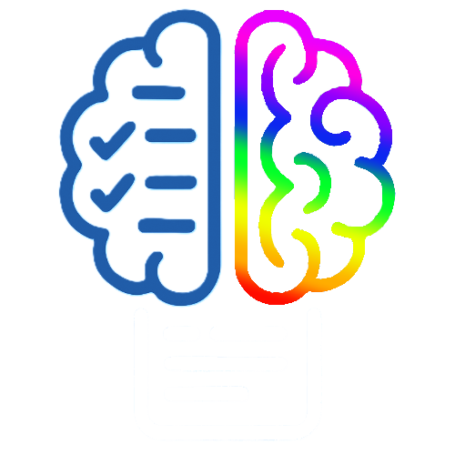

# Neurobd

<p align="center">

</p>

## Introduction

The *Neurobd* project was created with the goal of providing an interactive and scalable platform for managing and analyzing clinical data related to Attention Deficit Hyperactivity Disorder (ADHD). Based on modern technologies such as [**MongoDB**](https://www.mongodb.com/), [**Python**](https://www.python.org/) e [**Streamlit**](https://streamlit.io/), the system is designed to offer full CRUD operations (Create, Read, Update, Delete), including a join operation, through a simple and intuitive user interface for clinicians, psychologists, and psychotherapists.

The [reference dataset](https://www.kaggle.com/datasets/a7md19/adhd-dataset-4-classes-u2), available on Kaggle, contains information collected using the [**SNAP-IV**](https://www.icscanegrate.edu.it/uploads/files/LA_SCALA_SDAI.pdf) clinical questionnaire, enriched with supporting variables related to lifestyle and demographic characteristics.

## Miniworld description

The system models a *clinical miniworld* focused on managing information about patients diagnosed with ADHD. Data is divided into three main collections in the MongoDB NoSQL database:

- **subjects**: contains demographic information (age, gender, educational level, family history).

- **indicators**: collects behavioral habits (sleep hours, phone usage, physical activity, caffeine consumption).

- **assessments**: stores the results of the SNAP-IV questionnaires, aggregate scores for inattention and hyperactivity, and related difficulties (focus, organization, anxiety, learning).

Each subject is identified by a unique `subject_id` that logically links data across the three collections.

## Application context

The system can be applied in several contexts:

- **Clinical**: to assist specialists in collecting and reviewing behavioral and psychometric data of patients.

- **Research**: to collect data through administered tests and store them within the system, analyze patterns in SNAP-IV scores, and evaluate correlations between lifestyle factors and clinical manifestations of ADHD.

- **Educational**: for academic projects and experimental theses in healthcare, computer science, or psychology.

The flexibility of the NoSQL architecture and the use of Streamlit allow the system to adapt quickly to new clinical or experimental requirements.

## Proposed solution

The platform provides the following core features:

- **Streamlit Interface** for user-friendly interaction.

- **Automatic dataset loading** from CSV file and population of the MongoDB database on first run.

- **Automatic classification** of symptom severity based on SNAP-IV scores and predefined clinical thresholds.

- **Full CRUD support** for each collection (subjects, indicators, assessments).

- **Cross-collection JOIN** to obtain an aggregated patient view.

- **Automatic diagnosis** (No ADHD, Inattentive type, Hyperactive-Impulsive type, Combined type) based on specific clinical thresholds.

## Methodology used to develop the solution

### 1. MongoDB Database organization

The `neurobd` database is created locally with three logical collections (`subjects`, `indicators`, `assessments`) modeled using simplified relational normalization.

### 2. Loading and classification

On the first run, the `adhd_data.csv` file in the `dataset` folder is loaded and processed via a Python script:

- Calculation of total **inattention** scores (`Q1_1–Q1_9`) and **hyperactivity** scores (`Q2_1–Q2_9`).

- Classification of scores into four clinical severity levels (not significant, mild, moderate, severe).

- Automatic diagnosis based on clinical thresholds.

### 3. Streamlit interface

The Streamlit application allows users to:

- Insert new patients and associated data.

- View, update, and delete existing data.

- Perform cross-collection aggregation (JOIN).

- Provide immediate feedback on the diagnosis based on SNAP-IV scores.

## Installation

Make sure you have installed:

- [Anaconda](https://www.anaconda.com/)

- An environment named `neurobd` with Python version 3.10 and the following packages:

	- `streamlit`
	- `pandas`
	- `pymongo`

Otherwise, you can create it using the command:

```bash
conda create -n neurobd python=3.10 streamlit pandas pymongo
```

---

Then you can run `run.bat` on Windows or `run.sh` from a shell.

## References

[SNAP-IV Teacher and Parent 18-Item Rating Scale](https://shared-care.ca/files/Scoring_for_SNAP_IV_Guide_18-item.pdf)

[SNAP IV Self Rating Scale](https://rudheathsenioracademy.org.uk/wp-content/uploads/2024/10/SNAP-IV-Self-Rating-Scale.pdf)

[SDAI - Scala di disattenzione e iperattività – Cornoldi 1996](https://www.icscanegrate.edu.it/uploads/files/LA_SCALA_SDAI.pdf)